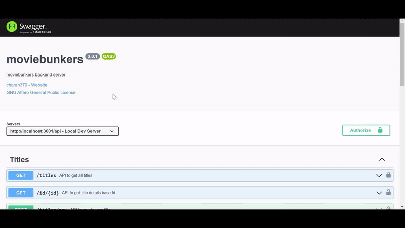

# moviebunkers :clapper:

[](https://github.com/charan379/moviebunkers)    [](https://github.com/charan379/moviebunkers) [](https://www.gnu.org/licenses/agpl-3.0.en.html)

This is REST API application. Developed using Express, Nodejs , Typescript


## Environment Variables

To run this project, you will need to add the following environment variables to your .env file

`DOMAIN_NAME`  
`MongoDB_SERVER_STRING`  
`HTTPS`  
`COOKIE_SECRET`  
`JWT_SECRET`  
`CORS_ORIGINS`  
`PORT`  
`NODE_ENV`  


####  Example 
`DOMAIN_NAME`=localhost  
`MongoDB_SERVER_STRING`=mongodb://127.0.0.1:27017/moviebunkers  
`HTTPS`=false  
`COOKIE_SECRET`=my cookie secret  
`JWT_SECRE`T=my jwt secret key  
`CORS_ORIGINS`=http://localhost:3080,http://yourapp.com  
`PORT`=3010  
`NODE_ENV`=production  

## Run

Clone the project

```bash
  git clone https://github.com/charan379/moviebunkers.git
```

Go to the project directory

```bash
  cd moviebunkers
```
Add Environment Variables then
Install dependencies

```bash
  npm install
```

Start the server

```bash
  npm run start
```

Start the server in dev

```bash
  npm run dev
```

Server will start running on given port

### Post-Installation
#### Swagger Documentation
```bash
    http://localhost:PORT/api-docs
````


## Authors

- [@charan379](https://www.github.com/charan379)

## License

 [](https://www.gnu.org/licenses/agpl-3.0.en.html)
